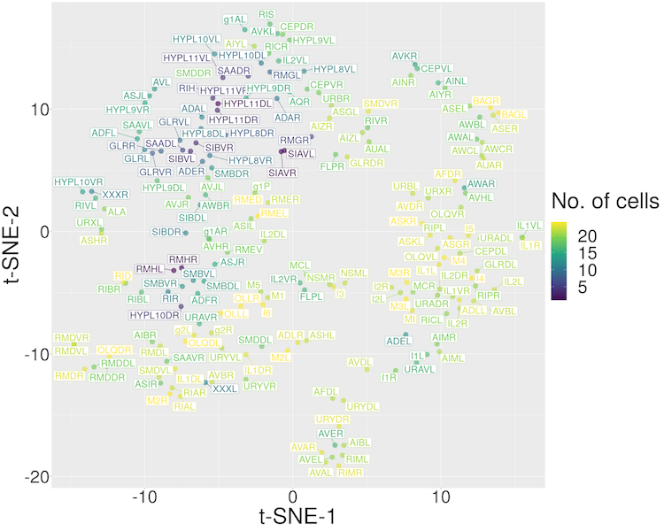

```{r, include = FALSE}
knitr::opts_chunk$set(
  collapse = TRUE,
  comment = "#>"
)
options(rmarkdown.html_vignette.check_title = FALSE)
```

# Load libraries
Install `WormTensor` package from CRAN or GitHub in advance and then type the code below in the R console window.
```{r Load libraries, echo=TRUE}
library(WormTensor)
```

# worm_download
`worm_download` is a function to retrieve data from figshare for a total of 28 animals (24 normal and 4 noisy).
If there is no argument,  mSBD distance matrices (including 24 normal animals) will be downloaded.
```{r worm_download, echo=TRUE}
object <- worm_download()
```

# as_worm_tensor
`as_worm_tensor` is a function to generate a `WormTensor` object from distance matrices.
A `WormTensor` object S4 class is used by `as_worm_tensor`, `worm_membership`, `worm_clustering`, `worm_evaluate`, and `worm_visualize`.
```{r as_worm_tensor, echo=TRUE}
object <- as_worm_tensor(object$Ds)
```

# worm_membership
`worm_membership` is a function to generate a membership tensor from a `WormTensor` object with distance matrices.
Set the assumed number of clusters to k(>=2).
```{r worm_membership, echo=TRUE}
object <- worm_membership(object, k=6)
```

# worm_clustering
`worm_clustering` is a function to generate a clustering result from a `WormTensor` object with a membership tensor.
```{r worm_clustering, echo=TRUE}
object <- worm_clustering(object)
```

# worm_evaluate
`worm_evaluate` is a function to generate an evaluation result from a `WormTensor` object with a `worm_clustering` result.
```{r worm_evaluate, echo=TRUE}
object <- worm_evaluate(object)
```

# worm_visualize
`worm_visualize` is a function to visualize a `worm_evaluate` result.
```{r worm_visualize, echo=TRUE}
object <- worm_visualize(object)
```
{width=100%}

{width=100%}

{width=100%}

{width=100%}


# Pipe Operation
The above functions can also be run by connecting them with R's native pipe.
```{r pipe_operation, echo=TRUE}
worm_download()$Ds |>
    as_worm_tensor() |>
        worm_membership(k=6) |>
            worm_clustering() |>
                worm_evaluate() |>
                    worm_visualize() -> object
```

# Pipe Operation (with Labels)
If you have a label for the cells, you can use it for external evaluation. 
```{r pipe_operation with Labels, echo=TRUE}
# Sample Labels
worm_download()$Ds |>
    as_worm_tensor() |>
        worm_membership(k=6) |>
            worm_clustering() -> object
labels <- list(
    label1 = sample(3, length(object@clustering), replace=TRUE),
    label2 = sample(4, length(object@clustering), replace=TRUE),
    label3 = sample(5, length(object@clustering), replace=TRUE))
# WormTensor (with Labels)
worm_download()$Ds |>
    as_worm_tensor() |>
        worm_membership(k=6) |>
            worm_clustering() |>
                worm_evaluate(labels) |>
                    worm_visualize() -> object_labels
```
{width=100%}

{width=100%}

{width=100%}

{width=100%}

{width=100%}

{width=100%}


# worm_distance
`worm_distance` helps you analyze your time-series data matrices with `WormTensor`.
`worm_distance` is a function to convert time-series data matrices into distance matrices.
The distance matrices can be used for analysis by `WormTensor`.
```{r worm_distance, echo=TRUE}
# Toy data (data of 3 animals)
n_cell_x <- 13
n_cell_y <- 24
n_cell_z <- 29
n_cells <- 30
n_time_frames <- 100

# animal_x : 13 cells, 100 time frames
animal_x <- matrix(runif(n_cell_x*n_time_frames),
    nrow=n_cell_x, ncol=n_time_frames)
rownames(animal_x) <- sample(seq(n_cells), n_cell_x)
colnames(animal_x) <- seq(n_time_frames)

# animal_y : 24 cells, 100 time frames
animal_y <- matrix(runif(n_cell_y*n_time_frames),
    nrow=n_cell_y, ncol=n_time_frames)
rownames(animal_y) <- sample(seq(n_cells), n_cell_y)
colnames(animal_y) <- seq(n_time_frames)

# animal_z : 29 cells, 100 time frames
animal_z <- matrix(runif(n_cell_z*n_time_frames),
    nrow=n_cell_z, ncol=n_time_frames)
rownames(animal_z) <- sample(seq(n_cells), n_cell_z)
colnames(animal_z) <- seq(n_time_frames)

# Input list for worm_distnce
X <- list(animal_x=animal_x,
    animal_y=animal_y,
    animal_z=animal_z)

# Pipe Operation
# tsne.perplexity must be adjusted for data size
worm_distance(X, "mSBD") |>
    as_worm_tensor() |>
        worm_membership(k=6) |>
            worm_clustering() |>
                worm_evaluate() |>
                    worm_visualize(tsne.perplexity=5) -> object
```

# Session Information {.unnumbered}

```{r sessionInfo, echo=FALSE}
sessionInfo()
```
